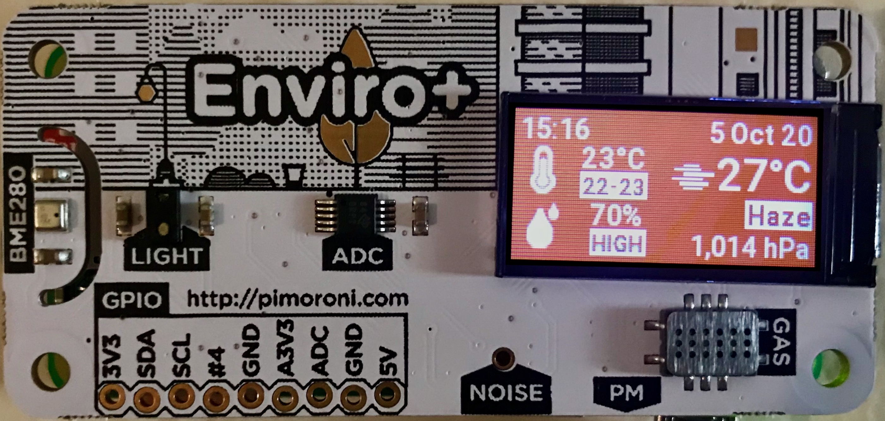

# Enviro-monitor

Indoor/outdoor environmental monitor project for the [Enviro+](https://shop.pimoroni.com/products/enviro?variant=31155658457171) environmental monitoring board.
Uses [OpenWeather](https://openweathermap.org/api) api to get the current weather and show it on the display.
Also, the display can be turned on/off by passing your finger near the light sensor to reduce energy consumption.



Python library and more steps to install can be found on [pimoroni/enviroplus-python](https://github.com/pimoroni/enviroplus-python)

## Installing

Install and configure dependencies from GitHub:

- `git clone https://github.com/pimoroni/enviroplus-python`
- `cd enviroplus-python`
- `sudo ./install.sh && cd ..`

**Note** Raspbian Lite users may first need to install git: `sudo apt install git`

- `git clone https://github.com/cesnietor/enviro-monitor.git`
- `cd enviro-monitor`

Add environment variables:

- Make sure you have a valid [APPID](https://openweathermap.org/appid) from OpenWeather on:

  ```
  curl https://api.openweathermap.org/data/2.5/weather?id=2172797&APPID=<UniqueUUID>&units=imperial
  ```

- Define [city id](https://openweathermap.org/current#cityid) and APPID as environment variables:

  ```
  export OPENWEATHERMAP_CITY_ID=<YourCityID>
  export OPENWEATHERMAP_APPID=<UniqueUUID>
  ```

- Change `time_zone` and `city_name` timezone and city for python timezone on enviro-monitor.py

## Running

```
python3 enviro-monitory.py
```

If you want to run it as a background process and your are using ssh on your raspberry pi
make sure the process is re-parented by init.

```
setsid python3 enviro-monitor.py < /dev/zero &> error.log &
```

If yout want to run it when the pi boots refer to [rc.local](https://www.raspberrypi.org/documentation/linux/usage/rc-local.md)
